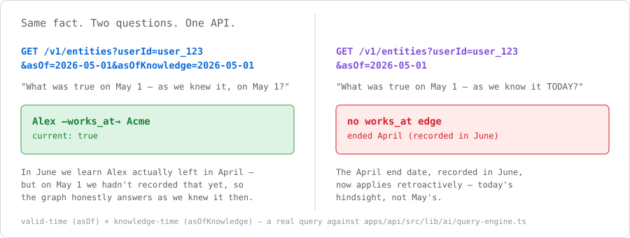

# Anansi

[](https://github.com/g-33-L/anansi/actions/workflows/ci.yml)
[](LICENSE)
[](https://www.npmjs.com/package/anansi-memory)
[](https://github.com/g-33-L/anansi/stargazers)

Anansi gives an AI system a durable understanding of how an organization actually
works — and how that changed over time.

You feed it the exhaust your company already produces: conversations, docs, tickets,
meeting transcripts. Anansi turns that into structured memory your agent can read
before it answers, and keeps every version of it. So you can ask not just *"what is
our escalation process?"* but *"what did we think it was in March, and when did it
change?"* — and get an answer with a citation.

Two API calls do the work:

```bash
POST /v1/ingest    # remember this
GET  /v1/context   # what do you know that's relevant right now?
```

`ingest` returns `202` immediately and does the expensive work on a queue, so it never
sits in your response path. `context` returns a compact, already-synthesized profile you
can paste straight into a system prompt — not a pile of chunks to rank yourself.

Self-hosted, MIT licensed, runs on Postgres and Redis. About five minutes to a working
instance, no signup.

**What that citation actually buys you** — the entity graph carries two independent
time axes, so you can ask what was true *and* what the system knew, separately:



---

## Quickstart — self-hosted, about 5 minutes

No account and no API key from us. Everything below runs on your machine.

Timings are measured, not aspirational: the API image builds from source in about
**90 seconds** on a warm Docker, and the embedding model is a **274 MB** download. The
five-minute figure assumes option **A** or **B** in step 2 — option **C** pulls a 7 GB
image and takes considerably longer.

### 1. Start the stack

```bash
git clone https://github.com/g-33-L/anansi.git
cd anansi
docker compose up -d
```

That brings up PostgreSQL, Redis, and the API. Migrations run automatically on first
boot. The API and docs serve at **http://localhost:3000**.

### 2. Give it something to embed with

**Anansi needs an embedding model, and Compose does not start one for you.** Skip this
step and ingest will appear to succeed — it returns `202` because embedding is
asynchronous — while retrieval fails with `503`. Open
[`/status`](http://localhost:3000/status); it reports the embedding backend explicitly,
so you can see the problem rather than infer it.

Three ways to satisfy it, ordered by how long they actually take. Only the first two keep
this quickstart inside five minutes.

<details open>
<summary><b>A. You already run Ollama on your host</b> — ~274 MB, under a minute</summary>

```bash
ollama pull nomic-embed-text
```

Nothing else to configure: Compose already points the container at
`host.docker.internal:11434`. This is the fastest path and the one to prefer if you have
Ollama installed.
</details>

<details>
<summary><b>B. Hosted embeddings</b> — instant, needs a free Nomic key</summary>

```bash
printf 'DEPLOYMENT_MODE=hybrid\nINFERENCE_LOCATION=local\nEMBEDDING_LOCATION=cloud\nNOMIC_API_KEY=your_key_here\n' >> .env
docker compose up -d api
```

All four lines are required. `DEPLOYMENT_MODE` defaults to `local`, which **forbids**
cloud providers outright — supplying `NOMIC_API_KEY` without switching to `hybrid` is a
deliberate startup failure, not an oversight, so the container refuses to boot and tells
you so. `hybrid` is what lets you mix local inference with cloud embeddings.

Confirm it took effect — the startup log states the resolved mode:

```
[startup] Deployment mode: hybrid (inference=local, embedding=cloud, telemetry=allowed)
```

Note that this sends the text you ingest to Nomic. Use A or C if that matters.
</details>

<details>
<summary><b>C. Ollama inside Compose</b> — fully self-contained, but a ~7 GB image pull first</summary>

**This is the slow path.** `ollama/ollama:latest` is about **7 GB** because it ships GPU
runtimes, and on a normal connection the pull alone takes ten minutes or more. Right
choice if you want everything in Compose and nothing on your host — not the right choice
if you are trying Anansi for the first time.

```bash
echo "OLLAMA_BASE_URL=http://ollama:11434" >> .env
docker compose --profile local-ai up -d       # pulls the 7 GB image
docker compose exec ollama ollama pull nomic-embed-text   # 274 MB
```

Appending is safe even if `OLLAMA_BASE_URL` is already set — Compose takes the last
definition. If you set it *after* the API was already running, restart it with
`docker compose up -d api` so it picks up the new address.
</details>

Whichever you pick, `nomic-embed-text` (274 MB) is all that ingest and retrieval need. The
much larger chat model (`llama3.1:8b`, ~4.7 GB) is only used to synthesize the `static` and
`dynamic` profiles — pull it later with `ollama pull llama3.1:8b` when you want those.

### 3. Create an API key

Keys live in your own database — this does not contact any hosted service:

```bash
docker compose exec api node dist/scripts/seed-dev-key.js you@example.com
```

It prints a key beginning `ans_`. Export it:

```bash
export ANANSI_API_KEY=ans_...
```

Each email address gets its **own workspace**, and memory never crosses between them.
Re-running the command with the same email issues another key into the same workspace;
running it with a *different* email gives you a key that cannot see anything you stored
earlier. If your data seems to have vanished, check which email the key came from.

### 4. Remember something

```bash
curl -X POST http://localhost:3000/v1/ingest \
  -H "Authorization: Bearer $ANANSI_API_KEY" \
  -H "Content-Type: application/json" \
  -d '{"userId":"user_123","content":"User is building a voice agent. Prefers TypeScript. Team of 4.","sourceType":"conversation"}'
```

Returns `202` immediately — embedding happens in the background.

### 5. Get it back

```bash
curl -G http://localhost:3000/v1/context \
  -H "Authorization: Bearer $ANANSI_API_KEY" \
  --data-urlencode "userId=user_123" \
  --data-urlencode "q=what is the user building?"
```

`relevant` comes back populated:

```json
{ "relevant": [ { "content": "User is building a voice agent. Prefers TypeScript. Team of 4.",
                  "similarity": 0.4821 } ], "static": [], "dynamic": [] }
```

Two things are worth knowing about that response:

- **`similarity: 0` means the embedding had not landed yet.** Embedding is asynchronous, so a query issued within a second of ingest can be answered by keyword search alone. Ask again and you will see a real cosine score. Search is hybrid, so you get an answer either way rather than an empty result.
- **`static` and `dynamic` stay empty** until a chat model is available for synthesis (step 2). That is expected, not a failure.

To prove the semantic half is genuinely working, ask something that shares no words with
what you stored:

```bash
curl -G http://localhost:3000/v1/context \
  -H "Authorization: Bearer $ANANSI_API_KEY" \
  --data-urlencode "userId=user_123" \
  --data-urlencode "q=which coding language do they like?"
```

That scores *higher* (`0.5915`) than the keyword-overlapping question, because nothing in
it matches literally — only in meaning.

### If something is wrong

Check [`/status`](http://localhost:3000/status) first: it reports Postgres, Redis, the
queue, **and** the embedding backend, and returns `503` when any of them is down. A `503`
from `/v1/context` names the failing dependency and how to fix it directly in the
response body.

### Notes on the Compose defaults

The Compose defaults are deliberately **development-only** and are sufficient to start a
disposable local stack without creating `.env`. The cryptographic values baked into
`docker-compose.yml` are published in this repository and therefore public — never use
them outside local development. For anything persistent, copy
[`.env.example`](.env.example), generate distinct values for `ENCRYPTION_KEY`,
`API_KEY_HMAC_SECRET`, `CSRF_SIGNING_KEY`, and `QUERY_API_KEY`
(`openssl rand -hex 32` each), and read
[`docs/enterprise/self-hosting.md`](docs/enterprise/self-hosting.md).
**Never change `ENCRYPTION_KEY` after first install** — all stored connector tokens are
encrypted with it.

If you run Ollama on your host rather than via the `local-ai` profile, the Compose
default (`host.docker.internal`) already points at it. A `.env` written for host-run
`pnpm dev` will contain `localhost:11434`, which inside a container means the container
itself — Compose interpolates that file, so the API silently cannot reach your host
Ollama. The `503` body names the address it tried, which is how you spot this.

Prefer running from source with `pnpm dev`? See [`CONTRIBUTING.md`](CONTRIBUTING.md) — note
that `pnpm test` needs `DATABASE_URL` and `REDIS_URL` in your shell, and that the suite
`TRUNCATE`s the local database, so do not point it at anything you care about.

---

## Usage

Using the TypeScript SDK ([`packages/sdk`](packages/sdk)):

```typescript
import AnansiMemory from "anansi-memory";

const memory = new AnansiMemory({
  apiKey: process.env.ANANSI_API_KEY,
  baseUrl: "http://localhost:3000", // required when self-hosting — see below
});

await memory.ingest({
  userId: "user_123",
  content: "User is building a voice agent. Prefers TypeScript. Team of 4.",
  sourceType: "conversation",
});

const ctx = await memory.context({ userId: "user_123", q: "what is the user building?" });
const systemPrompt = `You are a helpful assistant.\n\n${memory.formatForPrompt(ctx)}`;
```

> **Self-hosters: set the base URL.** Every client defaults to the hosted API at
> `https://anansimemory.com` (`packages/sdk/src/index.ts:173`,
> `packages/sdk-python/anansi_memory/client.py:77`). If you skip it, your calls go to the
> hosted service rather than your own instance, and your local key will not authenticate
> there. The option is `baseUrl` (TypeScript), `base_url` (Python), and `ANANSI_BASE_URL`
> (MCP).

Also shipped: Python (`anansi-memory`), MCP server (`anansi-mcp`), Vercel AI SDK
middleware (`anansi-ai-sdk`), LangChain/LangGraph (`anansi-langchain`), and
framework-agnostic tool definitions (`anansi-tools`). All are thin HTTP clients over the
same `/v1` API and contain no logic of their own.

### The full API surface

Eleven routes, all under `/v1`, all in
[`apps/api/src/routes/v1.ts`](apps/api/src/routes/v1.ts):

| Route | What it does |
|---|---|
| `POST /v1/ingest` | Store content. Returns `202`. |
| `POST /v1/ingest/batch` | Same, many at once. |
| `GET /v1/context` | Synthesized profile + relevant chunks. The main read. |
| `POST /v1/search` | Raw hybrid search when you want chunks, not a profile. |
| `GET /v1/memories` | Paginated raw chunks for a user. |
| `GET /v1/entities` | The entity graph, with `asOf` / `asOfKnowledge`. |
| `GET /v1/ledger` | Cited claims as of a point in time. |
| `GET /v1/ledger/divergences` | Where documented practice disagrees with observed practice. |
| `GET /v1/ledger/timeline` | When each answer was adopted and superseded. |
| `DELETE /v1/memory` | Delete memories (cascades to the entity graph). |
| `DELETE /v1/user` | Hard-delete a user: chunks, profile, graph. |

Full reference: [`docs/api/reference.md`](docs/api/reference.md).

---

## How it actually works

Three things are worth understanding before you commit to this.

### Two clocks

Every edge in the entity graph carries two independent time axes
([`lib/db/schema.ts`](apps/api/src/lib/db/schema.ts)):

- **valid time** (`valid_from` / `valid_until`) — when it was true in the world
- **knowledge time** (`recorded_at` / `valid_until_recorded_at`) — when the system learned it

Most memory stores have one clock, or none, and overwrite on update. That silently
rewrites history: if you learn in June that someone left in April, a single-axis store
now claims you always knew. Anansi keeps both, so
`GET /v1/entities?asOf=…&asOfKnowledge=…` reconstructs the graph as it was true *and* as
it was believed, at any instant. This is the bi-temporal model, borrowed from accounting
systems; the implementation is
[`getEntitiesForUser` in `lib/ai/query-engine.ts`](apps/api/src/lib/ai/query-engine.ts).

### Claims with citations

Alongside the graph, Anansi keeps an append-only ledger of attestations
([`lib/db/attestations-repo.ts`](apps/api/src/lib/db/attestations-repo.ts)): trust-tiered
(`observed` / `candidate`) claims, each backed by a verbatim quote located in a specific
source chunk. Nothing is auto-published — confidence defaults to 0 and status defaults to
`candidate`. Answers are never overwritten, only superseded.

`GET /v1/ledger/divergences` is the payoff: it surfaces where a documented answer (wiki,
runbook) disagrees with observed reality (chat, tickets), and when the practice changed.

### One database

Rows, vectors, and BM25 all live in Postgres. Retrieval is pgvector cosine similarity
fused with `ts_rank` BM25 by reciprocal rank fusion — a single SQL query, transactional
with everything else. There is no separate vector database to operate or keep in sync.

---

## What state this is in

Version `0.3.0`. Honest read, component by component.

**Solid.** The ingest → embed → synthesize → retrieve loop, the bi-temporal entity graph,
hybrid retrieval, the SDKs, the API-key auth and rate limiting. 40 test files under
`apps/api/src/test/`, roughly 417 assertions; `temporal-query.test.ts` is the executable
spec for the bi-temporal semantics. This is the part that has been exercised.

**Works, less proven.** The ledger endpoints are shipped and tested but young. The
connectors (Slack, Notion, Google Docs, Linear, transcript webhooks) work but each has
had limited real-world mileage. Synthesis quality with a local Ollama model has **not**
been systematically validated — evaluate it against your own data before relying on
generated profiles. Extraction quality is measured and the weaknesses are named in
[`apps/api/scripts/eval/BENCHMARK.md`](apps/api/scripts/eval/BENCHMARK.md); read it
rather than taking a number from this page.

**Experimental.** Executable skills / procedure extraction
(`lib/ai/skill-extraction.ts`, `lib/skill/`) — schema and extraction exist, there are no
public routes. `apps/graph-explorer` is a demo UI over `GET /v1/entities`, useful but not
a supported product surface.

**Not claimed.** No SOC 2, ISO 27001, or HIPAA certification. No data-residency
enforcement beyond choosing where you deploy. No published DPA.

---

## Identity, SSO, and access control

These exist. They are also newer and less exercised than the memory engine, so here is
precisely what is and is not true.

| Capability | Status |
|---|---|
| **OIDC SSO** | Implemented. Authorize → callback → JIT provision → session, at `GET /sso/:slug/login` and `/callback` (`lib/enterprise/sso/oidc.ts`). Not integration-tested against every major IdP. |
| **SAML 2.0 SSO** | Implemented via `@node-saml/node-saml` with `wantAssertionsSigned` and `wantAuthnResponseSigned` both enforced, no unsigned fallback path (`lib/enterprise/sso/saml.ts`). Live at `POST /sso/:slug/acs`; SP metadata at `/sso/:slug/metadata`. Unit tests cover config validation and profile mapping only — there is no end-to-end test against a real IdP. |
| **SCIM 2.0** | Users and Groups, per-org bearer token, mounted at `/scim/v2` (`lib/enterprise/scim/handler.ts`). Users: list, get, create, PATCH/PUT `active`, delete (= suspend membership, not global delete). Groups map to teams: list and create only — **no group-membership sync, no group update or delete**. Filters support `userName eq` and `emails.value eq`; anything else returns the full list. |
| **RBAC (console)** | 6 roles (`owner`, `admin`, `member`, `billing`, `auditor`, `viewer`) over 28 permissions, single source of truth in `lib/identity/roles.ts`, enforced by `requirePermission` on every `/console` route. |
| **API key scopes (`/v1`)** | Separate, coarser mechanism — five scopes (`ingest`, `read`, `entities`, `ledger`, `admin`) enforced on all 11 `/v1` routes via `requireScope` (`routes/v1.ts:202`); `validateApiKey` loads them in the existing auth query, so there is no extra round trip. **A key with no scope rows is unrestricted** — the console's documented back-compat rule, so no pre-existing key changes behaviour. Denial is `403` with `code: "insufficient_scope"`, plus `required_scope` and `key_scopes` in the body. See "Authentication and key scopes" in [`docs/api/reference.md`](docs/api/reference.md). |
| **Audit log** | Append-only `audit_events`, never updated or deleted, NDJSON export by keyset (`lib/enterprise/audit.ts`). Writes are best-effort and swallowed on failure by design. Emitted from console API-key, member, SSO, and enterprise-admin actions — **not from the `/v1` data plane**. Ingest and retrieval are not audited. |
| **Approval workflow** | Generic approval queue for `skill_publish`, `role_grant`, `data_export`, `connector_add` (`lib/enterprise/governance.ts`). Only one action currently *enforces* an approval: audit export, which returns 403 without an approved `data_export` request. The other kinds are recorded, not enforced. |
| **Configurable PII redaction** | Per-org rules (named detectors or regex; mask / drop / hash) applied after the built-in secret scrubber, wired into both the `/v1/ingest` path and the ingestion worker (`lib/enterprise/redaction.ts`). |
| **Signed licenses** | ed25519-verified, organization-bound, fail-closed (`lib/enterprise/license.ts`). See the note below. |

**How the gate works, plainly.** Console enterprise routes sit behind `requireEnterprise`,
which needs the org's `edition` to be `enterprise` plus — outside cloud mode — a license
signed by the key in `LICENSE_PUBLIC_KEY`. Because you set `LICENSE_PUBLIC_KEY` yourself
on a self-hosted install, you can generate an ed25519 keypair and mint your own license.
The gate is a deployment control, not a lock. That is deliberate and we would rather say
it than have you discover it.

---

## Security

Verifiable in this repo, not claims:

- **API keys** HMAC-SHA256 hashed at rest; the raw key is shown once and never stored (`lib/auth/api-auth.ts`).
- **Connector tokens** encrypted with AES-256-GCM under `ENCRYPTION_KEY` (`lib/utils/crypto.ts`).
- **SSRF guards** on every outbound fetch — URL ingestion and developer webhooks resolve DNS and reject private and loopback addresses, re-checking each redirect hop (`lib/infra/safe-fetch.ts`).
- **Rate limiting** per workspace via a Redis sliding-window sorted set in a single Lua script, with monthly quota on top (`lib/infra/rate-limit.ts`).
- **Input safety** — secret redaction and prompt-injection neutralization run on all end-user content before storage and before any LLM prompt (`lib/utils/sanitize.ts`).

**Tenant isolation is application-layer.** Every query scopes by `workspace_id` /
`developer_id`. Postgres RLS on `memory_chunks` is a NULL-guard backstop, not the
boundary. If you are contributing, any new query must carry the scoping predicate. See
[`docs/architecture/security-model.md`](docs/architecture/security-model.md).

Disclosure policy: [`SECURITY.md`](SECURITY.md).

### Deployment modes

`DEPLOYMENT_MODE` controls whether content can leave the machine
(`lib/config/deployment.ts`):

- `local` — air-gapped. Inference and embeddings run on Ollama; content-exporting telemetry is off. **The server refuses to start** if a cloud LLM key, cloud embedding key, or Sentry DSN is set. This is enforced at boot, not documented and hoped for.
- `hybrid` — explicit per-capability mix via `INFERENCE_LOCATION` and `EMBEDDING_LOCATION`.
- `cloud` — the default; cloud providers when keys are present, local fallback otherwise.

---

## Open core: what's here, what isn't

**The engine is MIT.** Ingestion, chunking, embedding, synthesis, the bi-temporal graph,
the ledger, hybrid retrieval, the connectors, the SDKs, and basic multi-user identity
(organizations, members, API keys) within a single self-hosted org. You can run all of
it, forever, without talking to us.

**One layer is commercial, not MIT:** enterprise auth (SSO/SAML, SCIM provisioning),
audit/governance/redaction workflows, team management, and the hosted control plane
(billing, the staff ops console). Those files carry a header naming `LICENSE-EE` — you
can read and evaluate them freely, but running them in production requires a commercial
license. See [`LICENSE-EE`](LICENSE-EE) for the exact terms, and `LICENSE` for the full
path list. This is the same shape as GitLab CE/EE or Sentry's open-core split: the code
is visible, the enterprise surface is licensed separately.

**The hosted service adds** operations, not capability: managed Postgres/Redis and
upgrades, self-serve signup and billing, managed connector OAuth apps (so you don't
register your own Slack/Notion/Google apps), support with a response time, and an
issued enterprise license for the EE surface above.

**Two things to know before you assume "MIT means unlimited":**

1. **The plan tiers exist in the engine, but they do not apply to you.** `lib/billing/plans.ts`
   and `feature-gate.ts` are MIT and part of the engine, and `routes/v1.ts` calls `gateFeature()`
   at ten sites — that machinery is here because the same code runs the hosted service.
   On a self-hosted install it is inert: a workspace with no subscription row defaults to
   `enterprise` — unlimited, nothing expires, every retrieval feature on.

   The default is chosen by whether upgrades are actually purchasable, which is detected
   by whether Stripe is configured (`resolveDefaultPlan` in `lib/billing/plans.ts`). No
   Stripe, no metering. Set `ANANSI_DEFAULT_PLAN` if you genuinely want to meter your own
   install.

   This is worth stating plainly because it used to be the other way round: the default
   was `free` everywhere, which on your own hardware meant 1,000 ingests/month and a
   7-day retention window that a background worker enforced by **deleting your data**. A
   memory engine that forgets after a week is not a product, and we fixed it rather than
   documenting it.

2. **Enterprise console routes sit behind an edition check** — self-hostable, but the code
   backing SSO/SCIM/audit/governance is `LICENSE-EE`, not MIT, so running it in production
   needs a license from us even if you mint your own signing key.

We are not going to relicense the *engine* or move existing MIT-licensed features behind
a paywall. That guarantee is about the code above the line, not the EE surface below it —
the MIT grant on the engine you already have is the part that is actually binding, not
this paragraph.

---

## API versioning

All public routes are prefixed `/v1` and every response carries an `API-Version` header.
Within a major version there are no breaking changes. Breaking changes ship only under a
new major path (e.g. `/v2`), with 90 days' notice on the prior version.

## Contributing

Issues and PRs welcome — [`CONTRIBUTING.md`](CONTRIBUTING.md) has the setup, and
[`ARCHITECTURE.md`](ARCHITECTURE.md) is the map. Good first reading:
`routes/v1.ts` (the whole API in one file), then `lib/ai/query-engine.ts`, then
`apps/api/src/test/temporal-query.test.ts`.

## License

Open-core. MIT for the engine, `LICENSE-EE` for the enterprise surface described above
— see [Open core: what's here, what isn't](#open-core-whats-here-what-isnt) for the full
path list, [`LICENSE`](LICENSE), and [`LICENSE-EE`](LICENSE-EE).
